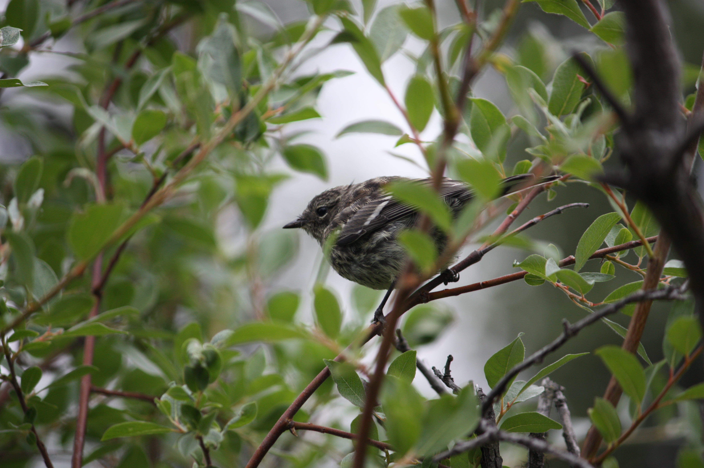

Here I have collected papers and notes that I have written. Any corrections/suggestions are welcome at [shyam.ravishankar@uni-muenster.de](mailto:shyam.ravishankar@uni-muenster.de).

## Preprints/Publications

[*The Massless Dirac Equation in Three Dimensions: Dispersive estimates and zero energy obstructions*](docs/3d_massless_Dirac.pdf), joint work with [W. Green](https://www.rose-hulman.edu/~green/), [C. Lane](https://connorlane04.github.io/), B. Lyons, A. Shaw. *Journal of Differential Equations*, 416:449--490, 2025. ([arxiv](https://arxiv.org/abs/2402.07675), [doi](https://doi.org/10.1016/j.jde.2024.10.005)).

## Bachelor's Thesis

[*Truncated Euler Systems*](docs/Senior%20Thesis.pdf), bachelor's thesis advised by [Tim All](https://www.rose-hulman.edu/~all1/).

[Poster presentation](docs/Senior_Thesis_poster.pdf) given at the [Rose Show](https://www.rose-hulman.edu/academics/academic-affairs/the-rose-show.html).

## Expository Materials

### Course notes

[Stable Homotopy Theory](docs/PCMI_Notes.pdf), based on the 2024 [PCMI USS](https://www.ias.edu/pcmi/pcmi-2024-undergraduate-summer-school) lecture series. Notes taken with Aden Shaw.

[Algebraic Number Theory 2](docs/Alg_NT.pdf), lectured by Eugen Hellmann at Universität Münster in Summer 2025.

### Seminar notes

[Flat morphisms and cohomology](docs/flat_morphisms_cohomology.pdf), seminar on cohomology of coherent sheaves, Universität Münster, Summer 2026.

[Explicit determination of the Satake transform](docs/Satake.pdf), seminar on the Satake isomorphism, Universität Münster, Summer 2026.

[Big Cohen&ndash;Macaulay Algebras](docs/Cohen_Macaulay.pdf), seminar on almost mathematics, Universität Münster, Winter 2026.

[Tate&ndash;Shafarevich Groups](docs/Tate-Shafarevich.pdf), seminar on Galois cohomology, Rose&ndash;Hulman, Winter 2024. Written with [Connor Lane](https://connorlane04.github.io/).

[The Hasse&ndash;Minkowski Theorem](docs/Hasse-Minkowski.pdf), with a cohomological interpretation by [Connor Lane](https://connorlane04.github.io/), seminar on Galois cohomology, Rose&ndash;Hulman, Winter 2024.

### Presentations

[Reflexive Spaces](docs/reflexive_spaces_slides.pdf), MA460 Functional Analysis, Rose&ndash;Hulman, Spring 2024. ([notes](docs/Reflexive_spaces.pdf))

[Kaluza&ndash;Klein Theory](docs/Kaluza-Klein_slides.pdf), PH410 General Relativity, Rose&ndash;Hulman, Spring 2024. ([notes](docs/Kaluza-Klein.pdf))

[Ramification of Knots](docs/Ramification_of_knots.pdf), MA461 Algebraic Topology, Rose&ndash;Hulman, Fall 2023.

[Constructible Polygons](docs/Constructible_Polygons.pdf), MA378 Number Theory, Rose&ndash;Hulman, Spring 2023.

### Other miscellany

[A pair of blog posts on computing homotopy groups of spheres](https://https://sravi0.github.io/otter-blog/posts/Homotopy%20Groups%20of%20Spheres/)

[An MSE post about analogies between algebraic number theory and geometry of curves](https://math.stackexchange.com/questions/4993013/analogy-between-algebraic-geometry-and-algebraic-number-theory-definitions-pica/4993067#4993067)

